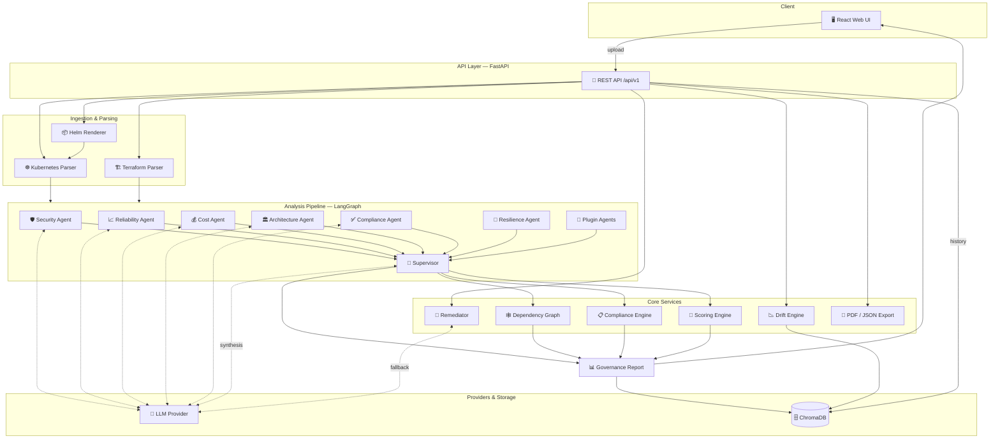
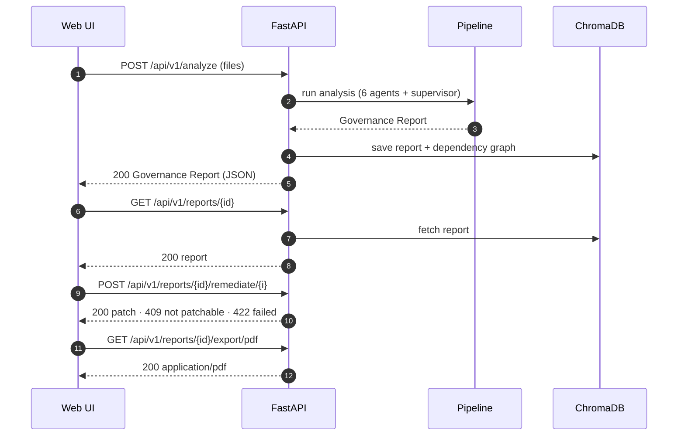

<div align="center">


# Infrastructure Governance & Architecture Intelligence

**A multi-agent platform that reviews your Terraform, Kubernetes, and Helm before it ships — scoring it for security, reliability, cost, architecture, compliance, and resilience, then handing you fixable findings.**

[](https://www.python.org/)
[](https://fastapi.tiangolo.com/)
[](https://react.dev/)
[](https://www.typescriptlang.org/)
[](tests/)
[](#license)

</div>

---

## Overview

Before you ship cloud infrastructure, you write it as code — Terraform, Kubernetes, or Helm files that describe your servers, databases, and networks. This platform reviews those files first and tells you what's wrong before it goes live.

Most tools that check infrastructure code (tfsec, checkov, kube-score) work off a fixed checklist: they match your files against a list of known rules and stop there. That catches the obvious mistakes, but it can't reason about how the pieces fit together.

This platform does both. It runs the same reliable rule checks **and** adds AI that reasons about your setup the way an experienced reviewer would — spotting problems no checklist can describe, such as *"if this one encryption key fails, four different services go down with it"* or *"there's nothing to fall back on if this component breaks."* Six specialized reviewers each examine a different concern — security, reliability, cost, architecture, compliance, and resilience — in a single pass.

What you get back is a **governance report**: an overall score, every problem ranked by how serious it is, a map of what would break if any one piece failed, compliance scorecards, and — for most issues — a ready-to-apply code fix.

## Highlights

- **Six governance agents** in a single analysis pass
- **Weighted governance score** with per-agent breakdowns
- **Dependency graph** with single-point-of-failure detection and blast-radius analysis
- **CIS compliance scorecards** (AWS · Azure · GCP · Kubernetes) with control-level mapping
- **Deterministic-first auto-remediation** — generates code patches, with an LLM fallback for the long tail
- **Drift detection** between successive scans of the same bundle
- **Auditor-ready exports** — PDF and JSON
- **Pluggable LLM** — local Ollama by default; Anthropic, OpenAI, or Google can be configured

## The six agents

| Agent | What it reviews |
|-------|-----------------|
| 🛡️ **Security** | Public exposure, IAM, encryption, exposed secrets |
| 📈 **Reliability** | Health checks, replicas, resource limits, restart policy |
| 💰 **Cost** | Right-sizing, idle capacity, storage tiers |
| 🏛️ **Architecture** | Cross-cutting patterns, trade-offs, prioritized actions |
| ✅ **Compliance** | CIS benchmark scoring, control-to-finding mapping |
| 🔗 **Resilience** | Dependency graph, single points of failure, blast radius |

## Tech Stack

| Layer | Technology |
|-------|-----------|
| **Frontend** | React 18 · TypeScript · Vite · Tailwind CSS |
| **Backend** | FastAPI · Uvicorn |
| **LLM** | Ollama (local, default) · pluggable Anthropic / OpenAI / Google |
| **Orchestration** | LangGraph · LangChain |
| **Parsers** | PyYAML (Kubernetes) · python-hcl2 (Terraform) · Helm CLI (charts) |
| **Storage** | ChromaDB (persistent report history + vector search) |
| **Graph** | NetworkX (dependency analysis, SPOF detection) |
| **Packaging** | Docker · Docker Compose · published image on Docker Hub |

## Architecture



**How it fits together**

| Component | Role |
|-----------|------|
| **React Web UI** | Analyze, Report, and History screens. In production it's served by the API on the same origin. |
| **REST API** | FastAPI endpoints for analysis, reports, remediation, blast-radius, diagram, drift, and export. |
| **Helm Renderer** | Renders uploaded `.tgz` charts with `helm template`, then feeds the YAML to the Kubernetes parser. |
| **Kubernetes / Terraform Parsers** | Normalize `.yaml`/`.json` and `.tf`/`.hcl`/`.json` into a common resource model. |
| **Analysis Pipeline** | Six agents (plus any runtime-discovered plugin agents) analyze the resources; the **Supervisor** deduplicates findings, synthesizes summaries, and computes scores. |
| **LLM Provider** | Finding-producing agents reason with the configured model (Ollama by default; Anthropic / OpenAI / Google supported). The Remediator uses it only as a fallback. |
| **Core Services** | Dependency graph (SPOF + blast radius), compliance scorecards, drift comparison, weighted scoring, remediation, and PDF/JSON export. |
| **ChromaDB** | Persists reports (with their dependency graph) for history, drift, and similarity search. |

<details>
<summary><b>Request flow, step by step</b></summary>

1. **Upload** — the UI sends files to `/api/v1/analyze`. Helm charts render server-side; Kubernetes and Terraform files parse into a normalized resource model.
2. **Analyze** — the LangGraph pipeline runs six agents (plus plugin agents). Finding-producing agents reason with the configured LLM; the Supervisor deduplicates, synthesizes, and scores.
3. **Enrich** — core services build the dependency graph (SPOF + blast radius), compute CIS compliance scorecards, and calculate the weighted overall score.
4. **Persist** — the report and its dependency graph are stored in ChromaDB for history, drift, and similarity search.
5. **Act** — from a report, the user generates remediation patches (deterministic first, LLM fallback), views drift vs. a prior scan, and exports PDF/JSON.

</details>

### What you get — the Governance Report

Every analysis produces one **Governance Report**, returned as JSON and rendered in the UI:

- **Overall governance score** (0–100) with a per-agent breakdown
- **Findings** ranked by severity, each with resource, description, recommendation, and mapped compliance controls
- **Dependency graph** — nodes/edges, single points of failure, and blast radius per resource
- **Compliance scorecards** — CIS AWS/Azure/GCP/Kubernetes with pass/fail control lists
- **Architecture review** — trade-offs, patterns, cross-cutting gaps, prioritized actions
- **Executive & risk summaries**
- **Remediation** — a code patch (unified diff) per fixable finding
- **Exports** — the full report as PDF or JSON

> 📄 **See a real one:** [`docs/examples/governance-report-example.pdf`](docs/examples/governance-report-example.pdf) is a full governance report exported straight from the platform.

### API request flow




## Supported File Types

| Type | Extensions | Notes |
|------|-----------|-------|
| Kubernetes | `.yaml` `.yml` `.json` | Multi-document YAML; `List` kind in JSON |
| Terraform | `.tf` `.hcl` `.json` | AWS, Azure, GCP; HCL and JSON both supported |
| Helm charts | `.tgz` | Rendered server-side via `helm template` |

> Non-infrastructure files (`package-lock.json`, application config without `apiVersion`/`kind`, etc.) are rejected at upload to prevent hallucinated reports on unrelated content.

## Quick Start

The platform ships as a single container that serves both the API and the web UI on **one port (8000)**. It needs an LLM to reason with — by default a local [Ollama](https://ollama.com/download) model running on your host.

**Prerequisites (all options):** [Docker](https://docs.docker.com/get-docker/) · [Ollama](https://ollama.com/download) on the host, with the model pulled:

```bash
ollama serve             # start Ollama (skip if already running)
ollama pull gemma4:E2B   # one-time model download
```

> **Why Ollama runs on the host, not in the container:** the container reaches it over `host.docker.internal` (see the run commands below). Inside a container, `localhost` means the container itself — so the LLM URL is overridden to point back at your host machine.

### Option 1 — Run the published image (no build, no source checkout)

The image is on Docker Hub as [`bacdocker/infra-governance`](https://hub.docker.com/r/bacdocker/infra-governance). Pull and run it directly:

```bash
docker run --rm -p 8000:8000 \
  -e OLLAMA_BASE_URL=http://host.docker.internal:11434 \
  -v "$(pwd)/data/chromadb:/app/data/chromadb" \
  bacdocker/infra-governance:latest
```

If you have a local `.env` (copied from [`.env.example`](.env.example)) and want to use its settings — e.g. to switch to a cloud LLM provider — add `--env-file .env` before the image name:

```bash
docker run --rm -p 8000:8000 \
  --env-file .env \
  -e OLLAMA_BASE_URL=http://host.docker.internal:11434 \
  -v "$(pwd)/data/chromadb:/app/data/chromadb" \
  bacdocker/infra-governance:latest
```

What the flags do:

| Flag | Purpose |
|------|---------|
| `-p 8000:8000` | Exposes the app on `localhost:8000` |
| `-e OLLAMA_BASE_URL=http://host.docker.internal:11434` | Points the container at Ollama on your host (overrides the `localhost` default) |
| `-v "$(pwd)/data/chromadb:/app/data/chromadb"` | Persists report history across container restarts (optional) |
| `--env-file .env` | Loads LLM provider / model config from your `.env` (optional; sensible defaults apply without it) |
| `--rm` | Removes the container when it stops (drop it to keep the container around) |

### Option 2 — Docker Compose (from source)

From a checkout of the repo, Compose captures the same settings so you don't type flags:

```bash
docker compose up --build
```

`docker-compose.yml` builds the image, maps port 8000, overrides `OLLAMA_BASE_URL` to reach the host, mounts the ChromaDB volume, and loads `.env`. Prefer this when developing against local source; prefer Option 1 to just run the released image.

Once running, open:

| Service | URL |
|---------|-----|
| Web UI | http://localhost:8000 |
| Backend API | http://localhost:8000/api/v1 |
| API Docs | http://localhost:8000/docs |

### Option 3 — Local development (hot reload)

Run the backend and frontend as separate dev servers for live reload while editing.

**Additional prerequisites:** Python 3.11+ · Node.js 18+ · [Helm CLI](https://helm.sh/docs/intro/install/) (for `.tgz` charts)

```bash
# 1. Backend
python3 -m venv venv && source venv/bin/activate
pip install -r requirements.txt
cp .env.example .env
uvicorn app.main:app --reload --port 8001 --timeout-keep-alive 600

# 2. Frontend (second terminal)
cd web
npm install
npm run dev
```

Open **http://localhost:5173**. The Vite dev server proxies `/api` to the backend on port 8001. See [web/README.md](web/README.md) for frontend details.

## Configuration

| Variable | Default | Description |
|----------|---------|-------------|
| `LLM_PROVIDER` | `ollama` | `ollama` · `anthropic` · `openai` · `google` |
| `OLLAMA_BASE_URL` | `http://localhost:11434` | Ollama server URL |
| `OLLAMA_MODEL` | `gemma4:E2B` | Model to use |

> Cloud providers (Anthropic / OpenAI / Google) require their respective API keys and are opt-in; the default configuration uses a local Ollama model.

## API

| Method | Path | Description |
|--------|------|-------------|
| `POST` | `/api/v1/analyze` | Upload files (multipart) |
| `POST` | `/api/v1/analyze/text` | Analyze from `{"file_contents": {...}}` |
| `GET` | `/api/v1/reports` | List recent reports |
| `GET` | `/api/v1/reports/{id}` | Retrieve a report |
| `DELETE` | `/api/v1/reports/{id}` | Delete a report |
| `GET` | `/api/v1/reports/compare/{a}/{b}` | Compare two reports |
| `GET` | `/api/v1/reports/{id}/similar` | Find similar past reports |
| `GET` | `/api/v1/reports/{id}/drift` | Drift vs. the previous scan |
| `GET` | `/api/v1/reports/{id}/blast-radius?resource=` | What breaks if a resource fails |
| `GET` | `/api/v1/reports/{id}/diagram?format=mermaid` | Dependency diagram |
| `GET` | `/api/v1/reports/{id}/export/pdf` | Auditor-ready PDF |
| `POST` | `/api/v1/reports/{id}/remediate/{i}` | Generate a code fix for a finding |
| `GET` | `/api/v1/health` | Health check |

Full interactive reference at **`/docs`** when the server is running.

## Project Structure

```
├── app/                       # FastAPI backend
│   ├── main.py                # App entry — API + serves the built web UI
│   ├── models.py              # Pydantic data models
│   ├── api/routes.py          # REST endpoints
│   ├── agents/                # security · reliability · cost · architecture
│   │                          #   · supervisor · remediator
│   ├── parsers/               # kubernetes · terraform · helm
│   └── core/                  # graph · compliance · drift · store · pdf …
├── skills/                    # Agent prompt skill files (.md)
├── web/                       # React + TypeScript web frontend (Vite)
│   ├── src/                   # components · pages · API client
│   └── README.md              # Frontend setup & architecture
├── samples/                   # Sample infrastructure files
├── docker-compose.yml
├── Dockerfile                 # Multi-stage: build web → serve from API
└── requirements.txt
```

## Testing

```bash
pip install -r requirements-dev.txt
pytest
```

A **610-test** regression suite covers rule logic, dedup, scoring, parsers, the dependency graph, remediation, and per-sample regressions. Runs in seconds; no Ollama required (LLM is mocked). See [tests/README.md](tests/README.md).

## Documentation

- [Example governance report (PDF)](docs/examples/governance-report-example.pdf) — a real report exported from the platform
- [DEVELOPMENT_PHASES.md](DEVELOPMENT_PHASES.md) — development history and technical decisions
- [web/README.md](web/README.md) — frontend architecture and development
- [tests/README.md](tests/README.md) — test suite guide

## License

[MIT](#license)
